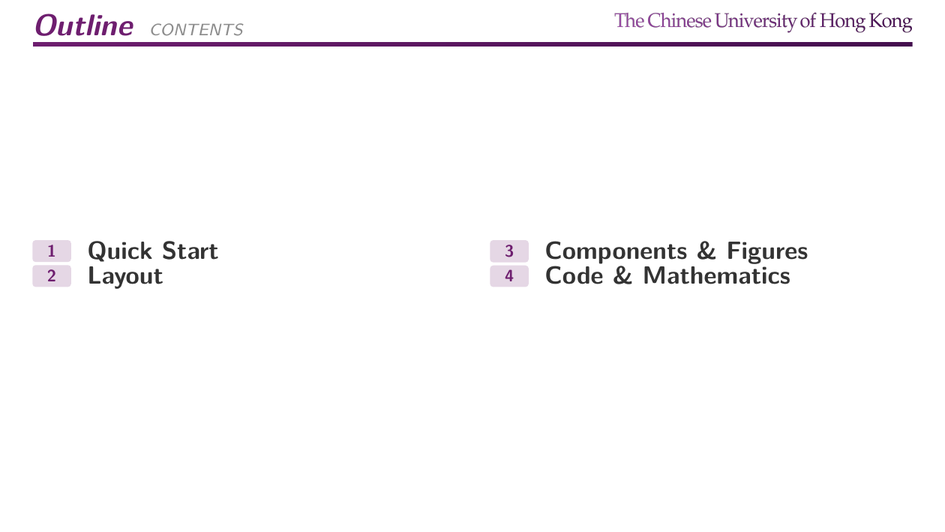
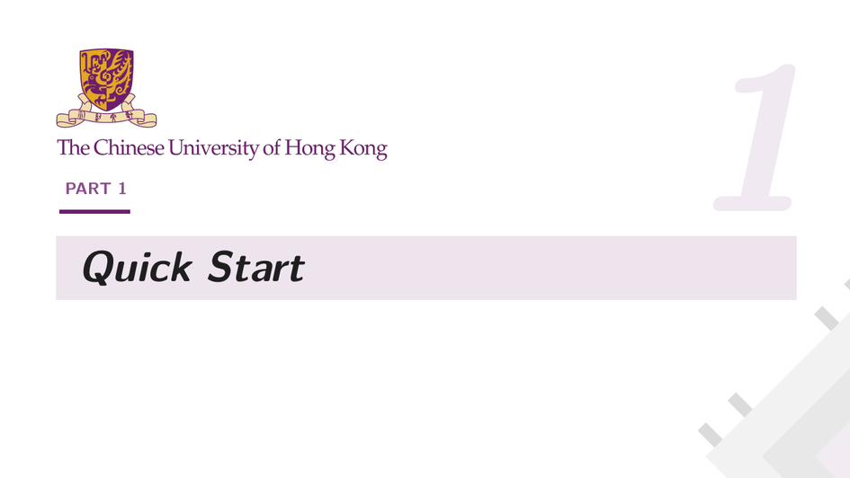
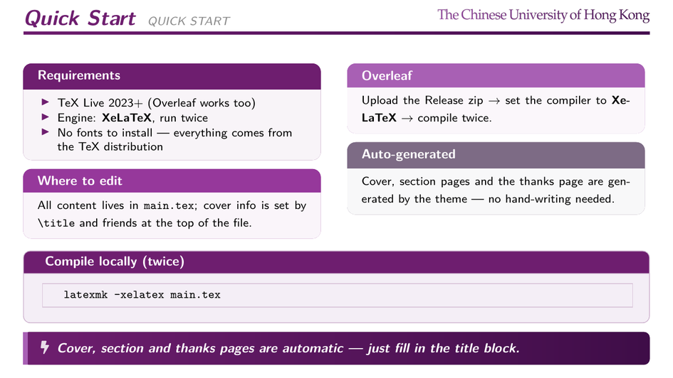
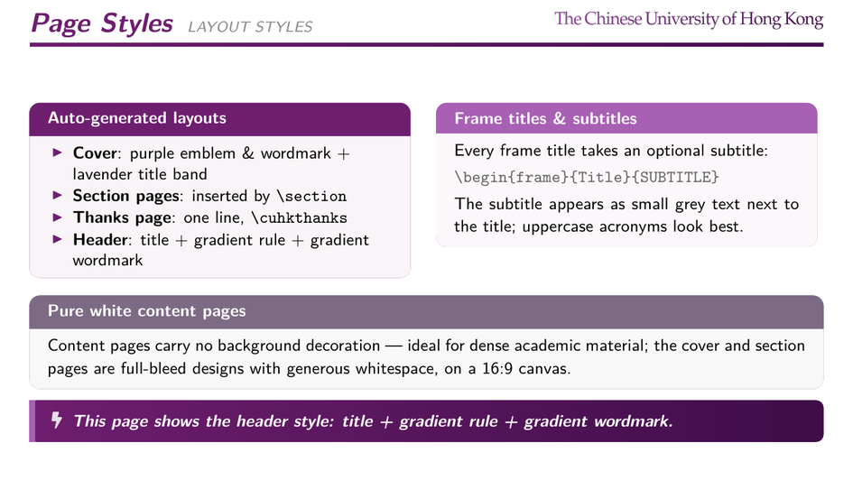
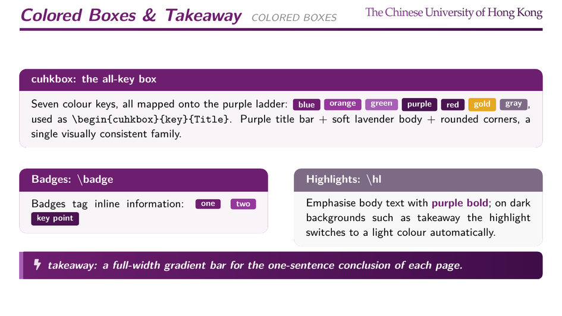
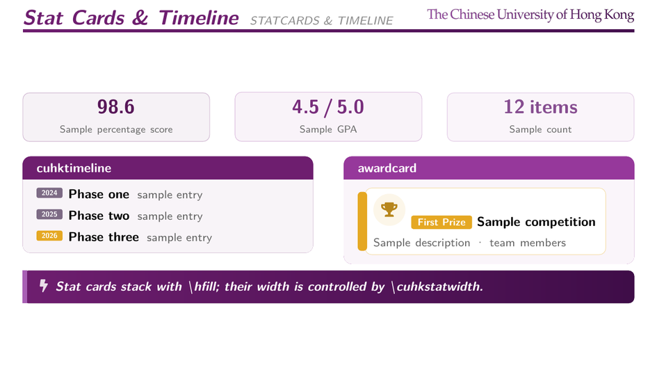
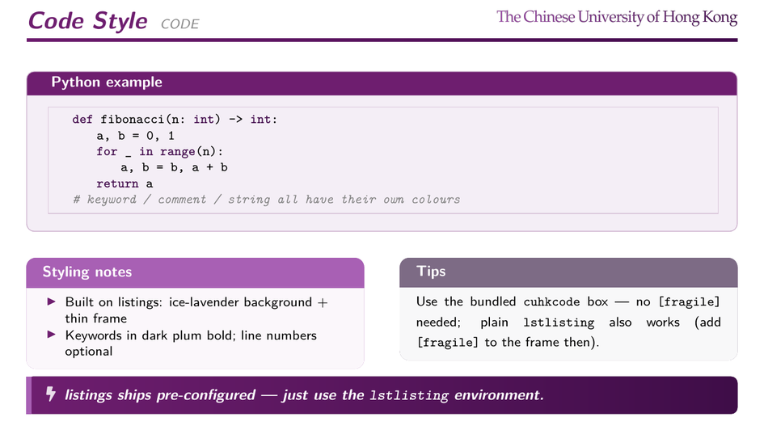
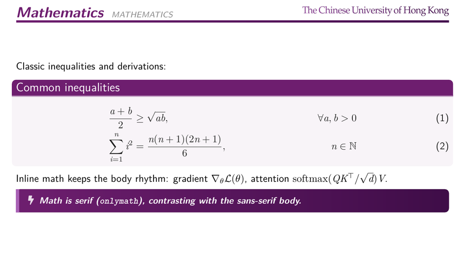
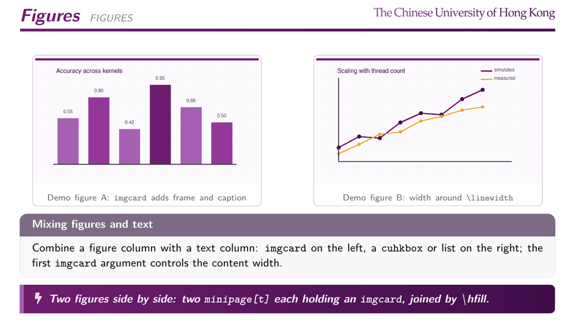
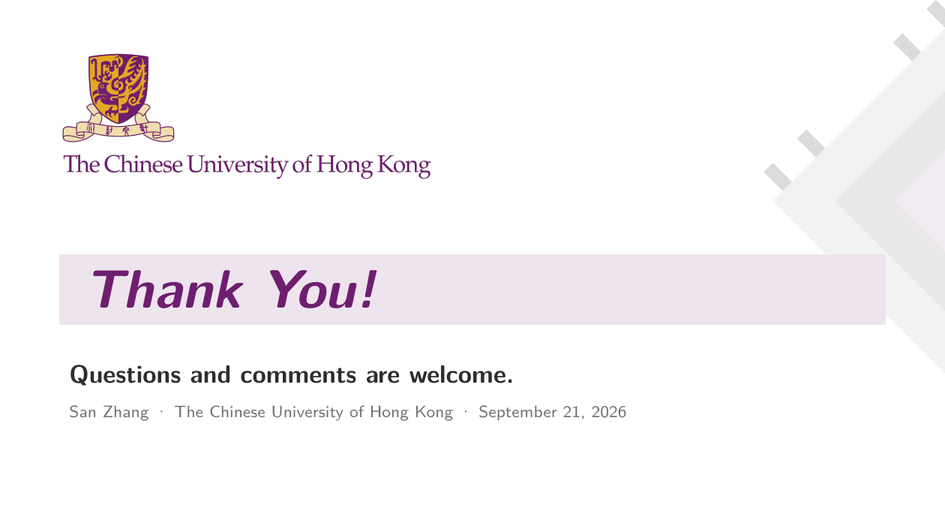

# CUHK Beamer Template (cuhk_beamer_pro)

> **Derived from [ForeverHYX/ZJU_Beamer_Template](https://github.com/ForeverHYX/ZJU_Beamer_Template)**, which is based on [qychen2001/ZJU-Beamer-Template](https://github.com/qychen2001/ZJU-Beamer-Template). Layout framework and component API follow upstream; license stays dual LPPL 1.3c / GPL 3.0.

An English-language academic Beamer theme in the visual identity of **The Chinese University of Hong Kong**: clean white pages, the official **CUHK purple** (`#6E1E6F`, sampled from the emblem) as the single colour ladder with the emblem **gold** (`#E5A823`) as accent, the shield emblem and serif wordmark on every full-bleed page. Overleaf-ready, no fonts to install.


## Quick start (Overleaf)

Download the zip from [Releases](../../releases) → new project → **Upload Project** → set compiler to **XeLaTeX** → compile twice.

## Local build

### Requirements

- TeX Live 2023+ or MiKTeX with the **XeLaTeX** engine
- Packages: `fontspec`, `tikz`, `tcolorbox`, `fontawesome5`, `booktabs`, `listings` (all in TeX Live full)
- Western font **Fira Sans** comes from the TeX Live `fira` package (`tlmgr install fira` if missing); without it the theme falls back to Latin Modern Sans, so it still compiles anywhere
- No CJK setup is loaded by default. To write Chinese, add in your preamble:
  ```latex
  \usepackage{xeCJK}
  \setCJKmainfont{Noto Serif CJK SC}   % any installed CJK font
  ```

### Compile

```bash
latexmk -xelatex main.tex      # recommended: settles TOC automatically
# or
xelatex main.tex               # manual, run twice
make                           # same as latexmk
make clean                     # remove auxiliary files
```

## Where to edit things

Everything lives in `main.tex`: the `\title` / `\author` / `\institute` block feeds the cover, sections drive the automatic transition pages, and `\cuhkthanks` produces the closing page. Theme internals are in `cuhk_beamer_pro.sty`. Customise the thanks-page signature with `\renewcommand{\cuhkthanksinfo}{...}`.

## Components

`cuhkbox` box (seven colour keys, all mapped onto the purple ladder) · `takeaway` gradient conclusion bar · `statcard` metric card · `awardcard` award card · `cuhktimeline` timeline · `cuhkcode` code box · `\badge` chip · `\hl` highlight · `imgcard` figure card — see the demo pages in `main.tex` for usage.

Colour keys: `blue` `orange` `green` `sky` `purple` `red` `gold` `gray` `steel` — every key resolves into the purple ladder so any mix of boxes stays on brand; `gold` keeps the emblem gold for medals and accents.

## Repository layout

```
main.tex              demo document (edit this)
cuhk_beamer_pro.sty   the theme
figures/              emblem, wordmarks and demo figures
screenshots/          README previews
```

## Credits

- [ForeverHYX/ZJU_Beamer_Template](https://github.com/ForeverHYX/ZJU_Beamer_Template) — direct upstream (ZJU purple edition of this design)
- [qychen2001/ZJU-Beamer-Template](https://github.com/qychen2001/ZJU-Beamer-Template) — original framework
- [TonyCrane's slides](https://slides.tonycrane.cc/) — layout hierarchy reference
- [SimplePlus Beamer Theme](https://github.com/pm25/SimplePlus-BeamerTheme) — header rule and block style reference
- [Fira Sans](https://github.com/mozilla/Fira) — western typeface

The CUHK emblem and name are trademarks of The Chinese University of Hong Kong; the assets in `figures/` are provided for personal and academic presentation use.

## Preview

### Outline



### Section page



### Quick start



### Multi-column layouts



### Colored boxes & takeaway



### Stat cards & timeline



### Code style



### Mathematics



### Figures



### Thanks page


